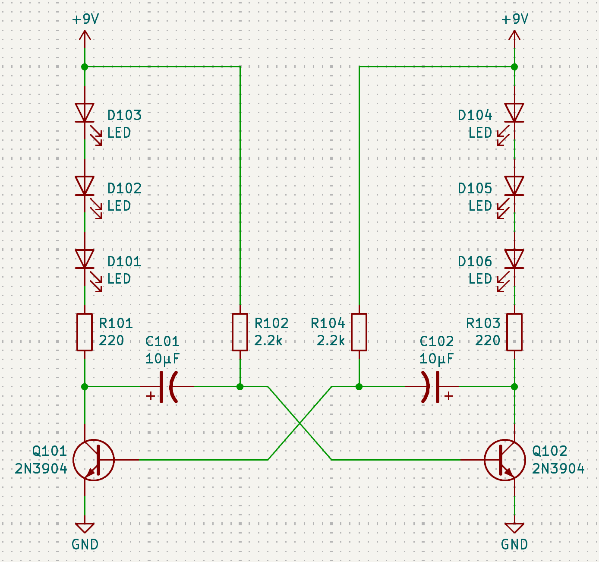
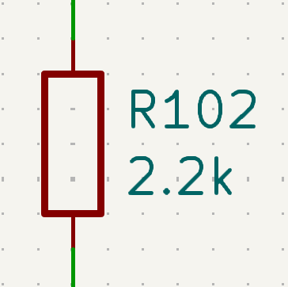
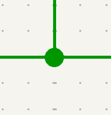
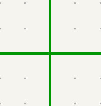
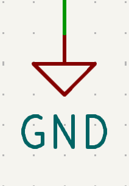
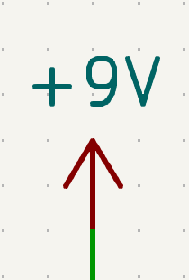
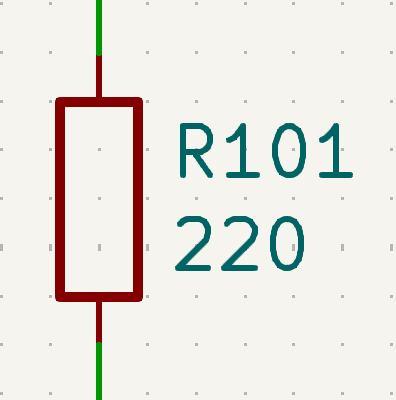
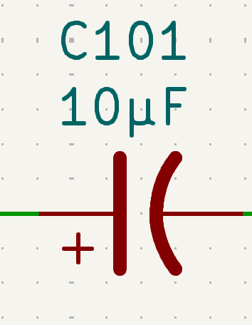
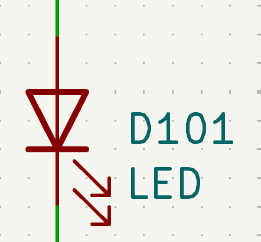
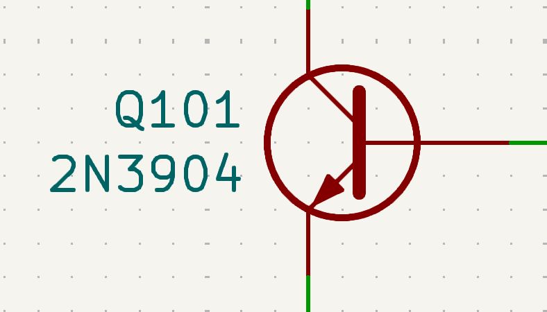

# Schematic

The first part of any PCB design is to draw the schematic that describes the electrical circuit for your PCB.

Since this isn't an electrical engineering training, the basic circuit has already be designed for you. However there are some details that still need to be completed that will give you an introduction to reading and navigating a circuit schematic diagram.

# Reading a Schematic

The schematic shows the components that make up an electrical circuit and the connections between them. 

In KiCad's default color scheme, the components are drawn in red. You'll see each component has blue labels next to it with a unique identifier like `R101` or `C102` and the component's value or description. 

The wires between the components are drawn in green. Note that when two wires connect to each other, the junction is shown with a green dot. 

If two wires cross without a dot, then the wires do not connect at that point. 

Finally, you'll set at the top and bottom there are connections to an upward pointing arrow labeled `+9V` and a downward pointing triangle labeled `GND`. 

 

These power symbols are used to mark connections to common reference voltages, in this case the positive and negative power connections to the 9V battery. Ground or `GND` is used to denote 0V, which is the point all the other voltages in the circuit are measured from. Note that all symbols of the same voltage are connected together, so the +9V is connected to both the main circuit and the positive terminal of the battery to the right. This helps to avoid drawing lots of wires everywhere we need power and ground, making the schematic easier to read.

# Editing the Schematic

To move the schematic view, you can use two-finger scroll on a laptop trackpad or the scroll wheel and middle-mouse drag with a mouse. Left click on a component to select it. You can then drag it around to reposition the component. Notice that the existing connections stay connected. You can right click on the component to bring up a menu of other options. Try selecting "Properties..." or press the default shortcut "E".

This will bring up the properties dialog where you can edit the details of the particular component you have selected. In particular, notice the Value field where you can define the component value and the Datasheet field with a link to the website where you can find more info about the component.

# Circuit Components

Now let's go over what components we'll be using in this circuit.

## Resistors

Resistors help restrict the flow of electrical current in the circuit. When there is a voltage difference from one side of the resistor to the other, the resistor allows a limited amount of current to flow proportional to how much voltage is applied. Exactly how much current is determined by the resistance of the resistor, measured in Ohms (Ω). The exact formula is $Current = \frac{Voltage}{Resistance}$, so a 1 Ohm resistor will allow 1 Amp of current to flow when 1 Volt of voltage is applied.

In the schematic, resistors are labeled starting with the letter R. Notice that the value of the resistor in Ohms is written underneath the identifier. Since resistor values can get very large, the value is written with SI prefixes. So a 1k resistor has a value of 1 kiloOhm, or 1,000 Ohms. A 1M resistor has a value of 1 MegaOhm, or 1,000 kiloOhms, or 1,000,000 Ohms.

## Capacitors

Capacitors are components that can store small amounts of electrical energy. They are often used to smooth out voltage fluctuations or filter out fast changing signals. and control how electrical energy moves over time. Since the voltage across a capacitor changes in a very predictable way depending on how much charge is stored in it, we can construct timing circuits by charging and discharging capacitors through carefully chosen resistors. In this circuit, the two capacitors are used to control how fast the LED's blink on and off.

The ability of a capacitor to store charge is called capacitance, measured in Farads (F). Since 1 Farad is an extremely large amount of capacitance, most circuit components are measured in microFarads (μF) or nanoFarads (nF). Recall that "micro" represents 1E-6, and "nano" represents 1E-9. So 1F = 1,000,000 µF = 1,000,000,000 nF

In the schematic, capacitors are labeled starting with the letter C. Depending on the type of capacitor, the schematic symbol may look slightly different. Notice that the symbol in our circuit has one curved line, with a small "+" on one side. This represents a polarized capacitor, where one side must be at a higher voltage than the other. Make sure you install the capacitor in the right direction! If the capacitor is drawn with two straight lines, this is a non-polarized capacitor where the direction doesn't matter.

## Diodes and LEDs

Diodes are made of special semiconductor materials that allow them to only conduct electricity in one direction. Notice how the diode symbol looks like an arrow pointing to a line. Current can only flow in the direction the arrow is pointing. Furthermore, the voltage across a diode is always the same regardless of how much current flows through it. This is called the diode's forward voltage, and it depends on how the diode is constructed.

In this circuit, we are using a special class of diodes, the Light Emitting Diode (LED). As the name implies, these diodes light up when current flows through them. In the schematic symbol, the little arrows coming out of the diode show that light will come out of this LED. The brightness of the light depends on how much current is flowing through, but there's an upper limit on how much current you can push into an LED before it burns out. This is why you should always have a resistor or some other way to control the current through the LED.

## Transistor

Transistors are semiconductor devices that allow a small electric current to control a much larger electric current. In the schematic, transistors have identifiers starting with the letter "Q". Notice how there are three connections to this transistor. The top connection is called the Collector, the middle connection is called the Base, and the bottom connection is the Emitter. The current between the base and emitter acts as a small diode. However, when the voltage between the base and emitter exceeds the forward voltage and the connection starts conducting, this also turns on the connection between collector and emitter.

Furthermore, the current allowed between the collector and emitter is a large multiple of the current flowing between the base and emitter, usually around 100x for the basic transistors we are using. Thus, a small base-emitter current can switch a much larger collector-emmitter current on and off. The transistor can also be used as an amplifier, effectively multiplying the base-emitter current by the 100x gain of the transistor. In this circuit, the transistor allows the small currents flowing through the capacitor-resistor networks to switch the entire strings of LEDs on and off.

# Finishing steps

There is one last step before this schematic is finished, you need to choose what color LEDs you want. Here are the LEDs we have in stock:

| Color | URL |
| ----- | --- |
| Red | https://www.digikey.com/en/products/detail/inolux/INL-5AR30/7604627 |
| Yellow | https://www.digikey.com/en/products/detail/inolux/INL-5AY30/7604629 |

1. Edit the LED components on each side of the circuit and fill in the color you want as the Value field. Copy the corresponding link into the "Datasheet" field.
2. What is the total cost of the components to make one copy of your board? Look at the price charts on the websites linked for each component to find the unit cost for each component. Show your work.
3. Your design has gone viral and now you need to make 1,000 copies of your board. What is the component cost of each board, taking the bulk discounts into account?
